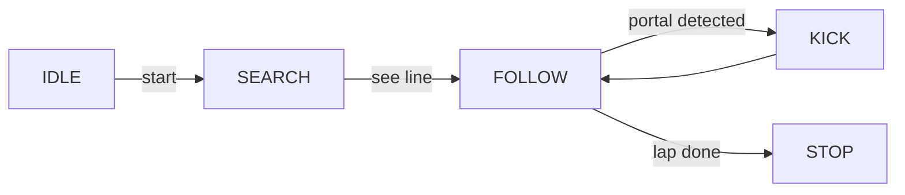

# Line‑Following Portal‑Kicking Robot 🤖🏁
**Robótica Computacional – Final Project (2023.2)**  
*Author – Fernando Ganzer Koelle*

---

## 1 · Project Summary
This repo hosts the code and Gazebo assets for a **fully‑autonomous differential‑drive robot** that:

1. Locks onto a **colour‑coded line** (blue at the start, pink halfway).  
2. **Completes a full lap** of the track, returning to the starting point.  
3. **Detects every yellow “portal”** along the way and knocks it over with a fast arm swing.  
4. **Stops automatically** once the loop is done.

Built on **ROS Noetic** (Ubuntu 20.04) for the *Computational Robotics* course at **Insper University**.

---

## 2 · Key Features

| # | Capability | Stack / Algorithm |
|:-:|------------|-------------------|
| 1 | Finite‑State Machine (search → track line → kick portal → finish) | `rospy`, custom dispatcher |
| 2 | Dual‑colour line tracking (blue → pink) | HSV thresholding + centroid steering |
| 3 | Yellow portal detection & knock‑down | Colour mask + arm actuation (`Float64`) |
| 4 | Sim‑to‑real with one camera‑calibration switch | RealSense intrinsics YAML |

---

## 3 · Repository Layout
```
pf-robcomp-23b-ex3/          ← Catkin package (drop in catkin_ws/src)
├── CMakeLists.txt
├── package.xml
└── scripts/
    ├── q3.py                ★ Main FSM / navigation node
    └── …                    Helper modules
pista.png                    Track schematic (blue→pink, yellow portals)
README.md                    ← you are here
```

---

## 4 · Quick Start

### 4.1 Prerequisites
* **Ubuntu 20.04** + **ROS Noetic desktop‑full**
* Gazebo 11 (bundled with desktop‑full)
* Python 3.8, `opencv-python`, `numpy`, `cv_bridge`, `sensor_msgs`, `geometry_msgs`

### 4.2 Build
```bash
# inside your catkin workspace
cd ~/catkin_ws/src
git clone https://github.com/<your‑user>/portal‑kicker‑robot.git
cd ..
rosdep install --from-paths src --ignore-src -r -y
catkin_make
source devel/setup.bash
```

### 4.3 Run (simulation)
```bash
roslaunch my_simulation corrida_de_obstaculos.launch &   # Gazebo world + RViz
roslaunch mybot_description mybot_control2.launch   &   # bring up arm controller
rosrun pf-robcomp-23b-ex3 q3.py                       # autonomous brain
```

### 4.4 Run (real robot)
```bash
rosparam load config/camera_intrinsics_realsense.yaml /camera
rosrun pf-robcomp-23b-ex3 q3.py
```

---

## 5 · Results
* ✅ **Lap success:** 100 % (10/10 sim runs)  
* ⚡ **Portals knocked:** 8 / 8 per lap  
* 🎥 **Demo:** <https://youtu.be/NYXu_f0AthM>

---

## 6 · How it Works
<details>
<summary>State‑machine diagram</summary>


</details>

---

## 7 · Roadmap / TODO
- [ ] Split image‑processing into standalone ROS nodes  
- [ ] Add GitHub Actions CI (`rostest`)  
- [ ] Provide Docker image for one‑command demo  

---

## 8 · License
MIT License — see `LICENSE`.

---

## 9 · Acknowledgements
Developed for *Computational Robotics* @ **Insper University** — thanks to Prof. Rodolfo Braga and the teaching staff for guidance and assets.

---

> *Open to issues and pull requests!* 🚀
